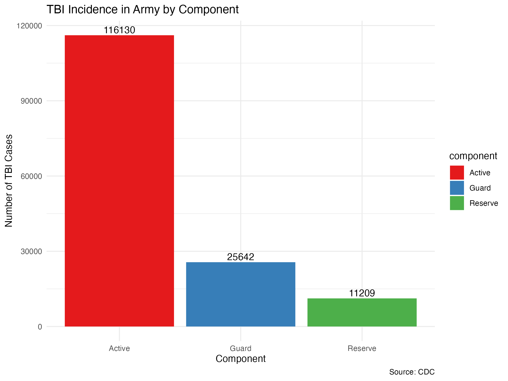

## Traumatic Brain Injury (TBI)

A traumatic brain injury, or TBI, is an injury that affects how the brain works. It is a major cause of death and disability in the United States. One of every 60 people in the U.S. lives with a TBI related disability. 

There are three main types of TBI:

* Mild
* Moderate
* Severe

Service members and Veterans are more likely to be affected by TBI.

*Source: CDC <https://www.cdc.gov/traumaticbraininjury/get_the_facts.html>*

## Research Question

Based on the provided information on Traumatic Brain Injury (TBI) from CDC, I raised several statistical questions that I want to explore and visualize. These questions focus on the prevalence, causes, and impacts of TBI, as well as demographic and situational factors associated with it. Those questions would help people understand more about TBI.

1. **Prevalence of TBI Types:**
   - What is the distribution of TBI types (mild, moderate, severe) among service members and veterans?

2. **Causes of TBI:**
   - What percentage of TBIs are caused by falls, struck by/against, motor vehicle, and assault?

3. **TBI Incidence Among Different Components of Army:**
   - How does the incidence of TBI compare across different components (Active, Guard, Reserve) within army?

4. **Age and TBI Deaths Result:**
   - What is the distribution of the death/non-death result of TBI among the age of children and elders?

## Dataset

I have utilized datasets from the `TidyTuesday` project, which provide a valuable resource for analyzing the patterns and causes of TBI.

1. `tbi_age.csv`: This dataset contains records categorized by age groups and details the type of measurement, the injury mechanism, the estimated observed cases in 2014, and the rate per 100,000 individuals in 2014. 

2. `tbi_year.csv`: Offering a temporal perspective, this dataset records the estimated observed cases each year.

3. `tbi_military.csv`: Particularly focused on military personnel, this dataset breaks down the occurrence of TBI by military branch, the component of service (active, guard, reserve), severity/type of TBI, and the number of diagnosed cases.

These datasets were accessed by utilizing the `tidytuesdayR` package, which streamlines the process of downloading TidyTuesday datasets directly into the R environment.

*The datasets are available through the TidyTuesday project on GitHub and can be accessed at: [TidyTuesday TBI Datasets](https://github.com/rfordatascience/tidytuesday/tree/master/data/2020/2020-03-24).*

## Result

1. **Prevalence of TBI Types:**
   - What is the distribution of TBI types (mild, moderate, severe) among service members and veterans?

The graph represents the TBI types among service members and veterans. The bar chart shows three categories of TBI severity: Mild, Moderate, and Severe.

- **Mild TBI** is by far the most common, with a total of 203,084 cases, which is significantly higher than the other categories. This suggests that mild TBIs are the predominant type of injury within this population.
- **Moderate TBI** cases total 19,226, indicating that moderate injuries are much less frequent than mild TBIs but still represent a considerable number of the injuries.
- **Severe TBI** cases are the least common, with 2,457 cases, which is much lower compared to mild and moderate TBIs.

The substantial difference in the number of cases across the three categories highlights the relative rarity of severe TBIs compared to mild and moderate ones. The implications could be many, including the possibility that service members and veterans are more frequently exposed to situations leading to mild TBIs.

***

2. **Causes of TBI:**
   - What percentage of TBIs are caused by falls, struck by/against, motor vehicle, and assault?
   

The graph is a pie chart representing the distribution of causes for TBI among all ages. 

- **Falls** are the leading cause of TBI, accounting for 48% of the cases. This indicates that almost half of the TBIs in the studied population are due to falls.
- **Struck by/Against** incidents are the second most common cause, making up 16.9% of TBIs. This category would typically include being hit by objects or colliding with objects accidentally.
- **Motor Vehicle** crashes are responsible for 13.1% of TBIs, which is a significant cause but less common than falls and being struck by/against.
- **Assaults** account for 7.5% of the TBIs, which suggests that violence is a less common but still notable cause of injury.
- **Unknown/Other** causes make up 14.5% of TBIs, indicating that a fair number of cases don't fit neatly into the other categories or the cause was not determined.

***

3. **TBI Incidence Among Different Components of Army:**
   - How does the incidence of TBI compare across different components (Active, Guard, Reserve) within army?

The graph is a bar chart depicting the incidence of Traumatic Brain Injury (TBI) across different components of the Army: Active, Guard, and Reserve.

- **Active Component**: The bar for the Active component is the tallest, indicating that among the Army components, active service members have the highest number of TBI cases. This could be due to the active duty members' greater exposure to combat situations, training exercises, and other high-risk activities that could lead to head injuries.

- **Guard Component**: The second-highest bar represents the Guard component. The number of TBI cases in the Guard component is significant but substantially lower than that of the Active component. This might reflect the part-time nature of service in the National Guard and the reduced exposure to combat compared to full-time active service members.

- **Reserve Component**: The Reserve component has the lowest number of TBI cases among the three groups. This may be because Reserve soldiers typically train less frequently than Active and Guard members and may have fewer deployments, leading to a reduced risk of sustaining TBIs.

***

4. **Age and TBI Deaths Result:**
   - What is the distribution of the death/non-death result of TBI among the age of children and elders?

The two bar charts are meant to show the distribution of TBI outcomes categorized as either "Death" or "Non-Death" within two specific age groups: "5-14" and "75+".

**First Graph (Age Group 5-14):**
- This graph shows that for children aged 5-14, the vast majority of TBI cases do not result in death, as indicated by the large blue bar representing 99.8% (348,306 cases) of the TBI outcomes. 
- The red bar, representing death outcomes, is almost negligible at 0.2% (607 cases). 

**Second Graph (Age Group 75+):**
- For the elder age group of 75 and older, there is a notable increase in the proportion of TBI cases resulting in death, shown by the red bar at 3.5% (15,562 cases). 
- Despite this, the majority of TBI cases in this age group still do not result in death, as depicted by the blue bar at 96.5% (426,815 cases).

**Combined Interpretation:**
- Comparing the two graphs, it is evident that age is a significant factor in TBI outcomes. While children have a high survival rate post-TBI, the elderly face a greater risk of death, which could be due to a variety of factors including the presence of pre-existing conditions, reduced resilience, and the severity of injuries in this age group.

